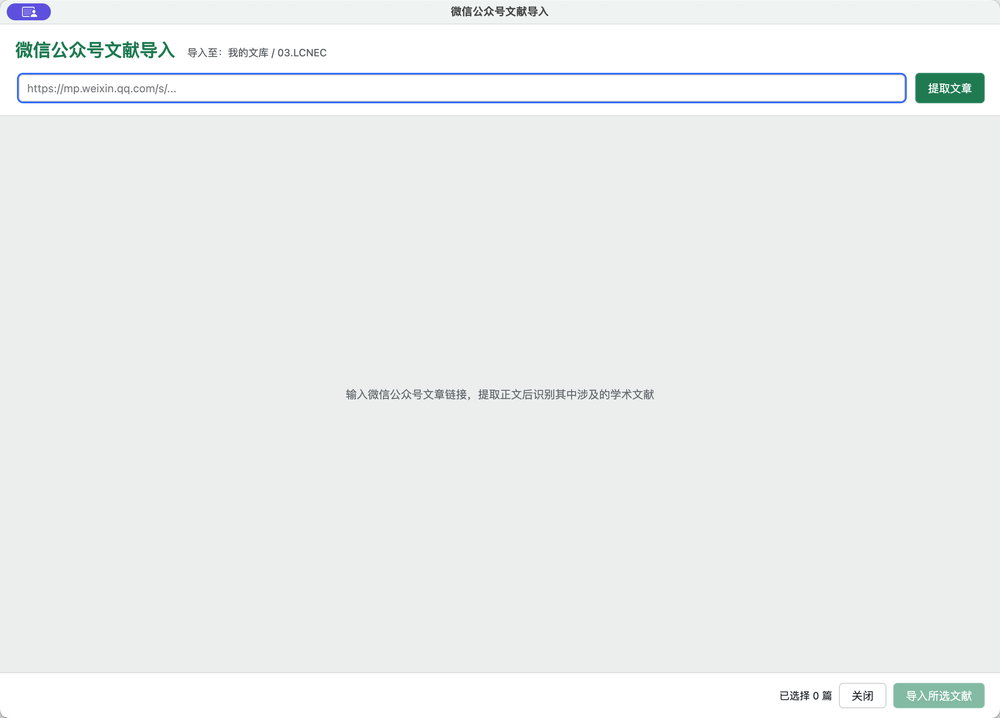

# 使用手册

本手册对应 `zotero-wechat-importer 0.2.x`。插件从微信公众号正文中提取论文线索，通过公开学术数据库核验后导入 Zotero，并让 Zotero 查找可用全文。

## 1. 使用前准备

需要：

- Zotero 9
- 可访问微信公众号文章、所选 AI 服务、PubMed 和 Crossref 的网络环境
- DeepSeek、Qwen、智谱 GLM 或 MiMo 的有效 API Key
- 一篇公开的微信公众号文章链接，格式通常为 `https://mp.weixin.qq.com/s/...`

不需要安装浏览器扩展，也不需要把 Zotero 文库上传到任何服务。

## 2. 安装、更新和卸载

### 安装

1. 打开项目的 [Releases 页面](https://github.com/nkbaim/zotero-wechat-importer/releases)。
2. 下载最新的 `zotero-wechat-importer-<version>.xpi`。
3. 在 Zotero 中选择“工具 → 插件”。
4. 点击插件管理器右上角的齿轮按钮，选择“从文件安装插件”。
5. 选择 XPI 并确认安装；如有提示，重新启动 Zotero。

安装后可以从两个位置打开：

- Zotero 文献工具栏中的微信图标
- “工具 → 从微信公众号文章导入文献…”

### 更新

从 Releases 下载新版 XPI，再按相同步骤安装即可覆盖升级。插件也提供更新清单，Zotero 在能够访问 GitHub 原始文件时可以检查更新。

### 卸载

在“工具 → 插件”中找到插件并选择移除。若保存过 API Key，可先在 Zotero 设置的“微信公众号文献导入”页面清空对应服务的 Key。

## 3. 选择导入位置

插件在**打开窗口时**读取当前目标位置：

- 选中“我的文库”或群组文库时，条目导入该文库根目录。
- 选中某个分类时，条目导入对应文库并加入该分类。

窗口标题下方会显示，例如：

```text
导入至：我的文库 / 03.LCNEC
```

如果目标不正确，请关闭插件窗口，在 Zotero 左侧重新选择文库或分类，再重新打开插件。



## 4. 提取微信公众号文章

1. 复制微信公众号文章的完整链接。
2. 将链接粘贴到窗口顶部。
3. 点击“提取文章”。

插件只接受：

```text
https://mp.weixin.qq.com/...
```

提取成功后会显示文章标题、公众号/作者、日期和正文编辑框。建议快速检查：

- 标题是否属于目标文章；
- 正文开头和结尾是否完整；
- 论文题名、DOI、图注或参考文献段落是否包含在正文中；
- 是否混入大量菜单、推荐阅读或无关内容。

正文可以直接修改。AI 服务读取的是编辑框中的当前内容，而不是最初下载的 HTML。

### 微信访问验证导致提取失败

微信可能返回验证页、空页面或不完整 HTML。插件会显示提取失败，但仍会打开正文编辑框。此时：

1. 在浏览器或微信中打开文章；
2. 复制文章标题和正文；
3. 将正文粘贴到插件的正文编辑框；
4. 保证正文不少于 80 个字符；
5. 点击“AI 识别并检索文献”。

手动粘贴模式下，来源链接仍可保留在顶部输入框中，供模型理解上下文。

## 5. 配置 AI 服务

打开 Zotero 设置，在左侧选择“微信公众号文献导入”。搜索窗口中不再填写 API Key。

1. 在“当前服务”中选择 DeepSeek、Qwen、智谱 GLM 或 MiMo。
2. 填写该服务的 API Key；确认 API 地址和模型名。设置页提供各服务的默认值。
3. 点击“测试当前模型连接”。连接成功后返回导入窗口分析文章。

四个服务分别保存配置；切换服务不会覆盖其他服务的 Key。API 地址填写基础地址，插件会补全 `/chat/completions`；也可以填写完整的请求地址。Qwen 专属 Workspace 和 MiMo Token Plan 地址可在这里配置。

| 服务 | 默认 API 基础地址 | 默认模型 |
| --- | --- | --- |
| DeepSeek | `https://api.deepseek.com` | `deepseek-flash` |
| Qwen | `https://dashscope.aliyuncs.com/compatible-mode/v1` | `qwen-plus` |
| 智谱 GLM | `https://open.bigmodel.cn/api/paas/v4` | `glm-4.7-flash` |
| MiMo | `https://api.xiaomimimo.com/v1` | `mimo-v2.6-pro` |

各服务的 Key 以明文保存在本机 Zotero 首选项中。共享设备上使用后，可在设置页清空相应 Key。升级自 0.1.x 时，旧版保存的 DeepSeek Key 和模型名会迁移到 DeepSeek 设置项。

测试连接会向当前服务发送一条简短请求，可能产生少量 API 用量。

## 6. AI 识别与数据库核验

点击“AI 识别并检索文献”后，插件分两阶段工作。

### 阶段一：所选模型提取线索

发送给所选 AI 服务的内容包括：

- 微信文章标题；
- 来源链接；
- 正文编辑框中最多 60,000 个字符。

模型最多返回 30 条候选线索，包括题名、作者、期刊、年份、DOI、PMID、检索短语和原文依据。插件会规范化 DOI/PMID、限制字段长度并删除重复线索。

### 阶段二：PubMed / Crossref 核验

每条候选按以下顺序核验：

1. 有 PMID：在 PubMed 精确查询。
2. 有 DOI：先查询 PubMed；未命中时查询 Crossref DOI 记录。
3. 只有题名：分别取得 PubMed 或 Crossref 候选，按题名相似度筛选。

数据库题录会覆盖 AI 生成的题录字段。AI 提供的“原文线索”只保留作人工复核参考。

处理多篇线索需要逐条访问数据库，耗时取决于文章长度、线索数量、模型响应速度和网络情况。窗口底部会持续显示当前进度。

## 7. 复核结果

结果表包含：

- 题名与作者；
- 微信正文中的原文线索；
- 期刊和年份；
- PMID 和/或 DOI；
- 核验来源或失败原因。

| 状态 | 说明 | 可导入 |
| --- | --- | --- |
| `PubMed` | PubMed 返回精确标识符匹配，或题名匹配达到阈值 | 是 |
| `Crossref` | Crossref 返回 DOI 记录，或题名匹配达到阈值 | 是 |
| `已存在` | 目标文库已有相同 PMID 或 DOI，结果中可复制 Zotero URL | 否 |
| `未核实` | 未找到可信匹配、请求失败或返回记录不满足要求 | 否 |

导入前至少检查：

1. 数据库题名与微信文章讨论的论文是否一致；
2. 作者、期刊和年份是否合理；
3. DOI/PMID 链接是否指向目标论文；
4. 原文线索是否真的支持这条识别结果。

点击已核实记录的题名，可以打开 PubMed 或 DOI 页面进一步检查。

“已存在”标签出现在标识符下方，旁边的“Zotero URL”点击后会复制定位该条目的 `zotero://select/...` 链接；新导入的条目完成后也会显示这个链接。

## 8. 导入 Zotero

1. 勾选一篇或多篇已核实记录；也可以选择“选择全部已核实文献”。
2. 点击“导入所选文献”。
3. 等待底部状态栏显示结果汇总。

导入时插件会再次检查 PMID/DOI 是否已经存在。随后使用 Zotero 内置标识符翻译器获取规范题录，并保存到打开窗口时确定的文库/分类。新导入条目处理完毕后，插件批量调用 Zotero 的“查找可用全文”；找到的文件会作为附件添加。

完成提示示例：

```text
导入完成：成功 4，已存在 1，失败 0
```

全文查找失败时，已导入的题录仍会保留，状态栏会显示错误。是否能获得 PDF 取决于 Zotero 的全文来源、网络、权限和开放获取情况。插件不保存微信公众号网页快照。

## 9. 常见问题与故障排查

### “请输入完整的微信公众号文章链接”

链接不是合法 URL。请从微信或浏览器地址栏复制完整链接，不要只复制标题或短文本。

### “目前仅支持 https://mp.weixin.qq.com/ 的文章链接”

当前版本会拒绝其他域名和 HTTP 链接。第三方转载页需要先手动复制正文。

### “页面中没有找到文章正文，可能触发了微信访问验证”

微信返回了验证页或页面结构发生变化。请手动复制正文并粘贴到编辑框。

### “正文过短”

插件要求正文至少 80 个字符。请检查是否只复制了标题、摘要或链接。

### “请先在 Zotero 设置中配置 API Key、地址和模型”

打开 Zotero 设置的“微信公众号文献导入”页面，填写当前服务的配置并测试连接。Key 前后多余空格会被自动去除。

### “分析失败：HTTP 401”

通常表示 API Key 无效、已撤销或格式错误。检查当前选中的服务及其 Key、API 地址。

### “分析失败：HTTP 402 / 429”

- `402` 通常与余额或计费状态有关；
- `429` 通常表示请求过于频繁或达到服务限制。

请登录所选 AI 服务的控制台确认账户状态，或稍后重试。

### “模型未识别出可检索的文献线索”

可能原因：

- 文章只讨论一般知识，没有明确论文线索；
- 论文信息位于图片中，正文文本没有包含；
- 正文提取不完整；
- 模型漏识别。

可补充图片中的题名、DOI 或参考文献文字到正文框后重新分析。

### 结果显示“未核实”

这不一定表示论文不存在。可能是题名被翻译/改写、数据库尚未收录、预印本信息变化，或者网络请求失败。当前版本为了减少误导入，不允许直接导入未核实线索。可以点击原文线索，手动到学术数据库继续检索。

### 导入失败或提示没有 Zotero 翻译器

数据库能核验记录，不代表 Zotero 标识符翻译器一定能解析。可以在 Zotero 主窗口使用“通过标识符添加条目”，手动输入 DOI 或 PMID 尝试导入。

### 全文查找失败或没有 PDF

插件会保留已导入的题录。全文查找依赖 Zotero 的可用来源；可在 Zotero 中对条目手动执行“查找可用全文”，并检查机构权限、网络或开放获取状态。

### 选择了错误的分类

目标在插件窗口打开时锁定。关闭窗口，回到 Zotero 左侧选择正确分类，再重新打开插件。已经导入的条目可以在 Zotero 中移动到正确分类。

## 10. 隐私与安全建议

- 不要处理包含患者信息、内部研究数据、账号凭据或其他敏感信息的文章正文。
- 不要在截图、Issues 或日志中公开 API Key。
- 共享电脑使用完毕后，在插件设置页清空已填写的 Key。
- 导入前人工核对数据库题录；“已核实”表示数据库匹配通过，不代表论文结论真实或研究质量可靠。

## 11. 功能边界问答

### 会把微信公众号文章本身存进 Zotero 吗？

不会。当前版本只从微信正文中识别并导入学术出版物。

### 会下载 PDF 吗？

插件导入题录后会让 Zotero 自动查找可用全文。找到可获取的 PDF 时，Zotero 会将其作为附件保存；找不到时只保留题录。

### 只能识别医学论文吗？

不是。PubMed 主要覆盖生物医学文献，Crossref 可以覆盖更广泛的带 DOI 学术出版物。但题名不完整、非正式出版物或数据库未收录内容可能无法核验。

### 为什么限制 30 条线索和 60,000 字符？

这是为了控制响应时间、模型费用和数据库请求数量，同时避免一次分析过多低质量候选。长文章应优先保留与论文相关的段落和参考文献部分。

### 为什么不能直接导入“未核实”记录？

因为最终题录不能只信任模型输出。强制数据库核验是插件降低 AI 幻觉风险的核心安全边界。
